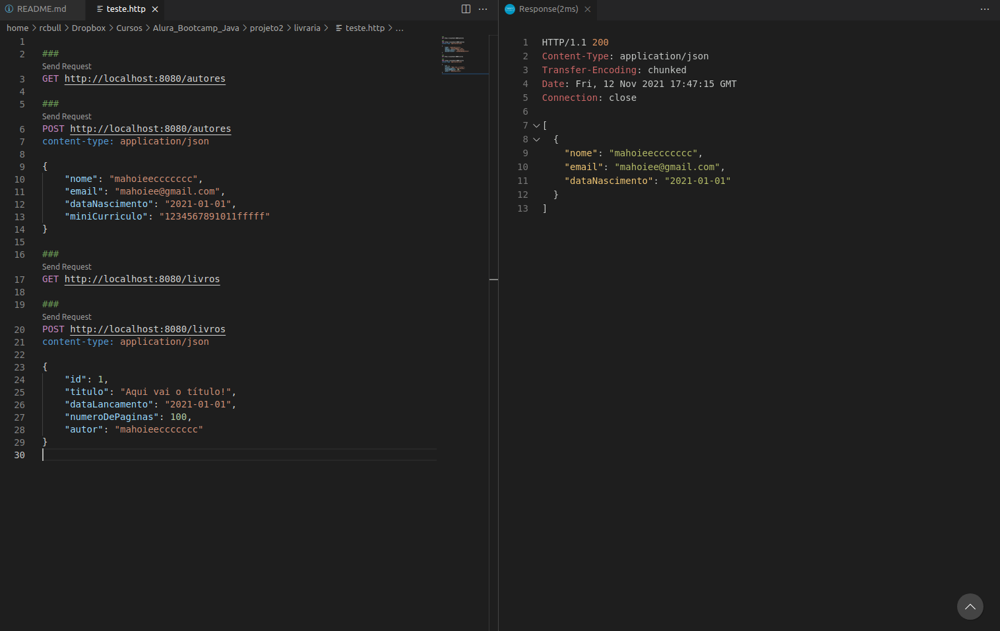

# Projeto 4

## Nova funcionalidade

1.  Instalar JUnit, AssertJ e Mockito, bem como os recursos de testes do Spring Boot

Nova funcionalidade
Além de implementar os recursos citados anteriormente, você também deverá implementar novas funcionalidades na API, que servirão para completar o CRUD de autores e livros.

Estas funcionalidade serão:

- Atualização dos dados de um determinado autor
- Exclusão de um determinado autor
- Detalhamento de um determinado autor
- Atualização dos dados de um determinado livro
- Exclusão de um determinado livro
- Detalhamento de um determinado livro
- Testes com Swagger

Utilize os recursos do Swagger para realizar os testes das funcionalidades da API como demonstramos durante as aulas.

## Testes via REST Client no VS Code

1. Instalar a extensão: REST Client

[VS Code Marketplace](https://marketplace.visualstudio.com/items?itemName=humao.rest-client)

2. Abrir o arquivo teste.http

3. Clicar nas requests

