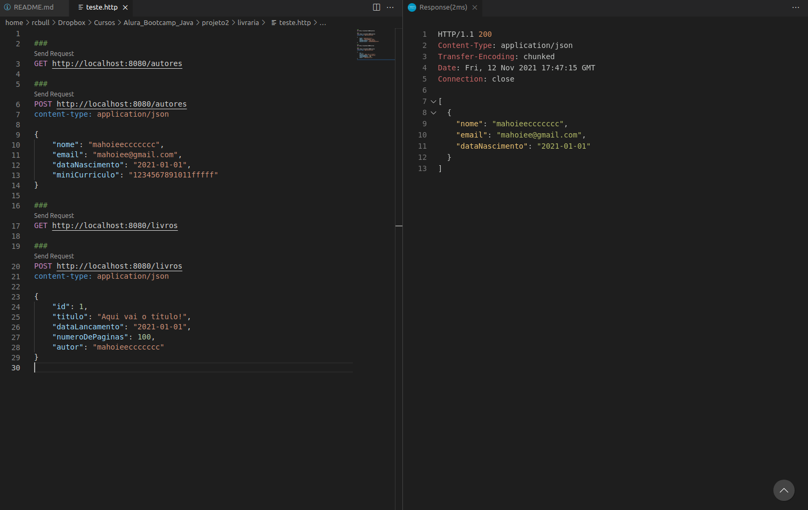

# Projeto 2

## Nova funcionalidade
Além da funcionalidade de cadastro e listagem de autores, você também deverá implementar uma nova funcionalidade de cadastro e listagem de livros.

Um livro deve possuir as seguintes informações: título, data de lançamento, número de páginas e autor.

Ao cadastrar um novo livro, as seguintes regras deverão ser validadas:

- Título deve ser obrigatório e ter no mínimo 10 caracteres;
- Data de lançamento deve ser uma data menor ou igual a data atual;
- O número de páginas deve ser maior ou igual a 100.

## Testes via REST Client no VS Code

1. Instalar a extensão: REST Client

[VS Code Marketplace](https://marketplace.visualstudio.com/items?itemName=humao.rest-client)

2. Abrir o arquivo teste.http

3. Clicar nas requests

